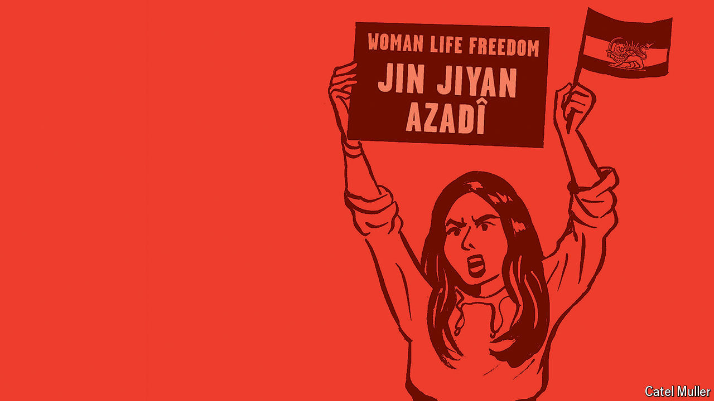

###### Iran, drawn

# A new graphic novel takes aim at Iran’s oppressive government 

##### The author of “Persepolis” returns with a riveting collection of illustrated stories 

 

> May 2nd 2024 

 By Marjane Satrapi. Translated by Una Dimitrijevic. 

Covering the mêlée of missiles exchanged between Iran and Israel in April, many newspapers, including this one, used . It was of a woman wearing a hijab and walking past a mural depicting Iranian rockets. The choice summed up the things for which Iran’s thuggish theocracy is best known: sabre-rattling and controlling women. 

