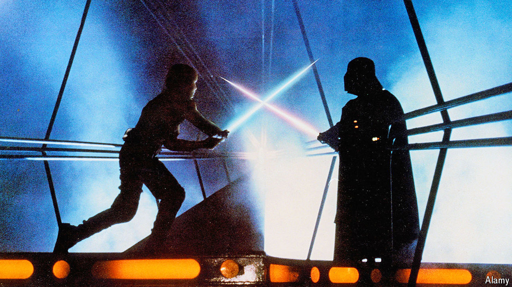

###### Back Story

# Fed up with Biden v Trump II? Some succour from fictional rematches 

##### From “Moby Dick”, “Star Wars” and “Rocky” to the presidential election 

 

> Apr 29th 2024 

Picture a pair of adversaries—let’s call them Joe and Donald. In a story of rivalry, vanquishment and triumph, Joe beats Donald in a race or a fight. Now imagine they face off again. This drama is richer; it has the old ingredients plus stubbornness, grudges and the dream or delusion of a second chance.

It is six months until the  between Joe Biden and Donald Trump on November 5th—the first in a presidential contest since Dwight Eisenhower defeated Adlai Stevenson again in 1956. Once more common, electoral rematches have grown rarer as national politics has become an unforgiving, one-strike-and-you’re-out game. (Characteristically, Mr Trump is an exception.) On screen and in literature, however, the rematch is a staple of storytelling. Art can illuminate the stakes and motives when past combatants clash anew.

