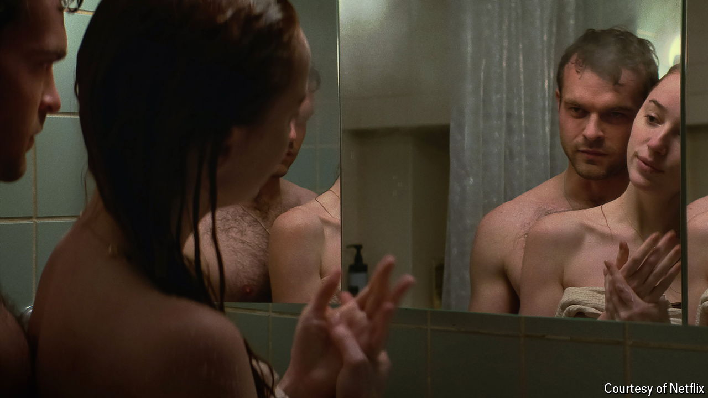

###### Frisky business

# Is there more or less sex on screen? 

##### Data show that the amount of sexual content in top films has sharply declined since 2000 

 

> May 1st 2024 

FIFTY YEARS ago the Supreme Court dabbled in film criticism. A cinema manager in Georgia had been prosecuted for “distributing ” in the form of “Carnal Knowledge” (1971), a film about two men’s sexual pathologies starring Jack Nicholson and Art Garfunkel. It was rated R, denoting adult content, but it was hardly explicit. In one scene you can hear moans of pleasure, but all you see is an empty living room. The court ruled that the film was not obscene. 

Scriptwriters, directors and distributors in the West no longer fear censors’ wrath. But the subject of sex is being judged again—this time in Hollywood circles. Recently film-makers, critics and viewers have been debating the lack of sex on screen. Some feel that Hollywood has entered a puritanical age and place blame at the feet of the  and the ubiquitousness of celibate , as well as the need to appeal to buttoned-up markets abroad. Others disagree; they point to examples of highly explicit scenes in recent films, including “Fair Play” and “Poor Things”, which involve sex in public toilets and brothels.

