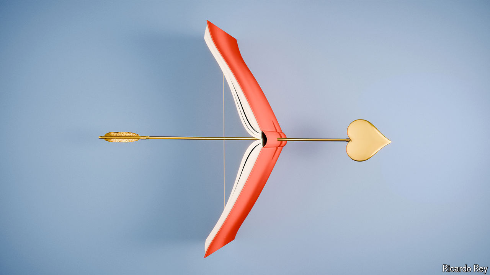

###### Feeling horny

# Romantasy brings dragons and eroticism together. At last 

##### Novels starring hot fairies are selling millions of copies 

 

> Apr 26th 2024 

Perhaps it is Frodo’s hairy feet. Perhaps it is because orcs are not that erotic. Perhaps it is because too many characters sing songs containing words like “merry-o” and “deedle-dum-diddle”. Whatever the reason, one thing is clear: J.R.R. Tolkien’s “The Lord of the Rings” is rarely considered an erotic romp. 

Fantasy books generally are not.  is a child; Aslan is an animal. And though books by writers such as Ursula Le Guin, of the “Earthsea” series, do contain sex, they also contain phrases in the vein of “the hormonal secretion is further stimulated”, which rarely set pulses racing. One exception is , which does contain lashings of sex. But since it also contains actual lashings, not to mention phrases such as “beat her bloody”, it is not usually considered romantic. 

