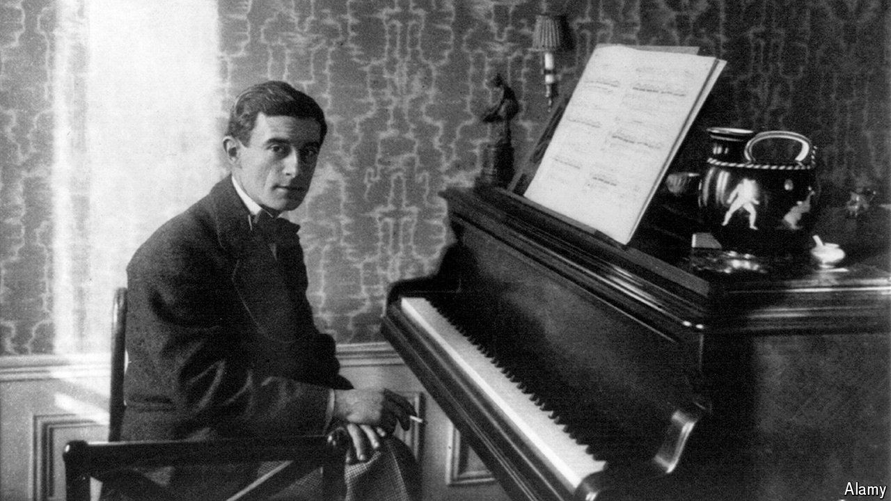

###### Can’t get you out of my head

# “Boléro” is among the most lucrative works of classical music 

##### It is also at the forefront of a new film and copyright dispute 

 

> May 2nd 2024 

MAURICE RAVEL’S “Boléro” is a strange piece of music, consisting of two melodies repeated nine times each. Originally the score to a ballet, it is catchy and keeps running in the listener’s head long after it ends. “Boléro”, a new French biopic about Ravel’s struggle to compose the work in 1928, also employs repetition. Anne Fontaine, the director and co-writer, returns to Ravel’s tortured sexuality, fascination with mechanical noise and slow mental deterioration. He died in 1937 of a brain disease; neurologists think it may have been frontotemporal , which is associated with obsessive repetition.

“Boléro” is among the most famous tunes in . The royalties it has generated from live performances, recordings and film soundtracks are estimated at more than $100m. The question of who got all that money is complicated. Ravel had no descendants. On his death the copyright passed to Ravel’s brother, who married his caretaker after a car accident. She then left the rights to her first husband, who married his manicurist. Ultimately the copyright wound up belonging to that manicurist’s daughter from a previous marriage, Evelyne Pen de Castel. 

