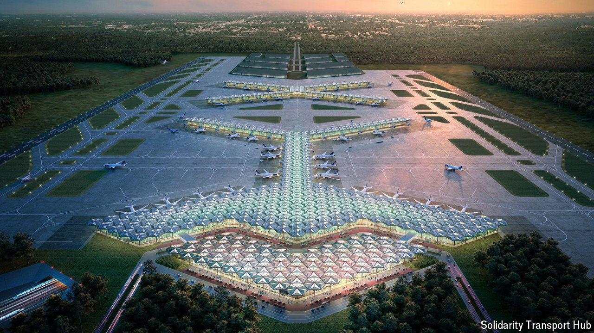

###### Grand schemes

# Donald Tusk mulls which of the previous government’s plans to axe 

##### The Polish populists’ projects were often preposterous, but not always 

 

> May 2nd 2024 

ELZBIETA ZIMMERMANN fears her barn will collapse. She has put off repairs since 2017, when she heard that the government would build a mega-airport on the site of her farm in Podoryszew, 50km west of Warsaw. The project has been put on ice since Poland’s populist Law and Justice (PiS) party, which championed it, was voted out in late 2023. PiS’s centre-right successors have promised more fiscal responsibility. But scrapping mega-projects means sunk costs and dashed hopes.

The liberal government that took over in December inherited a mixed bag of investments. Some are too far along to cancel, such as a shipping channel in an out-of-the-way lagoon that cost over 2bn zloty ($495m) to build. Despite its dubious value, Donald Tusk, the prime minister, said he would finish the final 900 metres. Other projects can still be reconsidered. An effort to produce a Polish electric car (a partnership with Geely, a Chinese firm) has cost the state some 500m zlotys since 2016. Land for a factory has been bought, but construction keeps getting put off. In April the government said it needed to rethink the investment’s “formula”.

