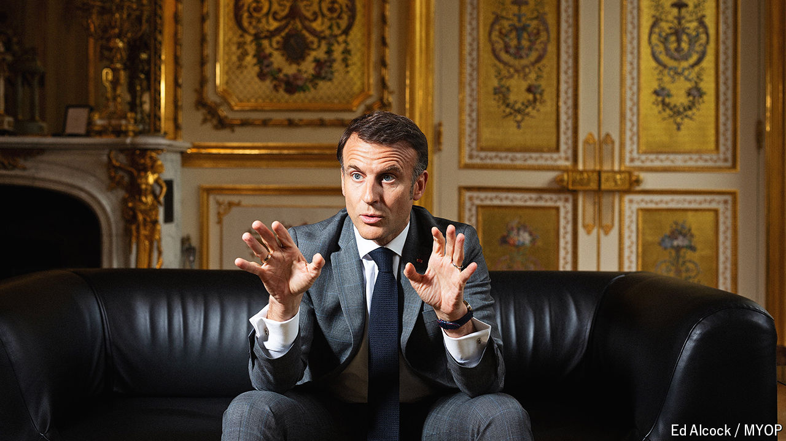

###### At the Elysée Palace

# Emmanuel Macron on how to rescue Europe 

##### The French president on grave risks to the continent, and what to do about them 

 

> May 2nd 2024 

SEVEN years ago, when Emmanuel Macron was first elected president of France, it was with a campaign infused with optimism about Europe. The leader who sat down with  on April 29th is an altogether graver figure. He has lost none of his combative energy. But his analysis of the threats encircling Europe is resolutely bleak. At stake is the survival of Europe as a safe place, a guarantor of prosperity and the liberal democratic order. “A civilisation can die,” Mr Macron warns, and the end can be “brutal”. “Things can happen much more quickly than we think.”

Mr Macron is speaking just days after giving a  at the Sorbonne in which he first said that “our Europe can die”. In our interview, conducted in the first-floor  of the Elysée Palace, the French windows thrown open to the broad lawns below, the president stresses far more starkly the urgency and gravity of the moment. His worry concerns not just the European Union, or even the defence of European territory. It is about the durability of a set of rules and values, underpinned by economic wealth and physical security, which bind all Europeans. 

