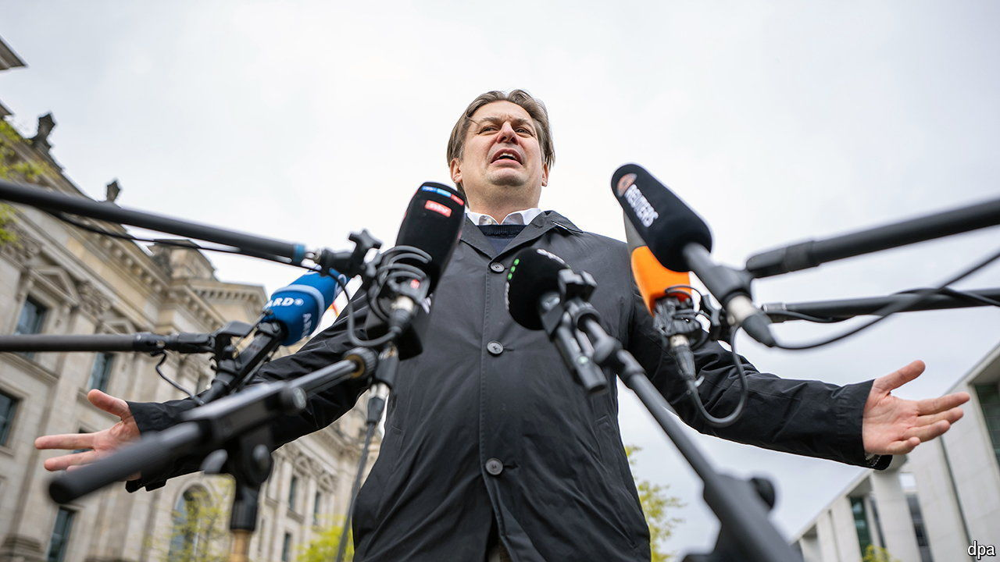

###### Chinese whisperers

# Espionage scandals are hurting Germany’s far right 

##### Charges of Chinese and Russian influence mar Alternative for Germany’s European campaign 

 

> May 2nd 2024 

On April 27th Alice Weidel and Tino Chrupalla, the co-leaders of the hard-right Alternative for Germany (AfD) party, held a rally in the southern town of Donaueschingen to launch their campaign for the European Parliament’s elections in June. Their (lead candidate) was not invited to speak. Maximilian Krah, a member of the European parliament, is in the doghouse. Last week Germany’s prosecutor-general arrested his aide Jian Guo, a German of Chinese origin, on charges of spying for China; he remains in custody. Mr Krah was known among fellow MEPs for his refusal to back resolutions critical of the Asian power. One fellow MEP called him “China’s loudest vassal”.

Like other hard-right parties, the AfD once expected huge gains in the European elections. But a series of scandals has made that look unlikely. In January the German press reported that, at a meeting with a notorious Austrian far-right activist, party members had discussed encouraging “remigration” of foreign-born Germans. That touched off weeks of protests which drew hundreds of thousands of people. In early April press reports alleged that Petr Bystron, an AfD mp, was paid €20,000 ($21,300) by a Russian disinformation network. Mr Bystron denies the allegations.

