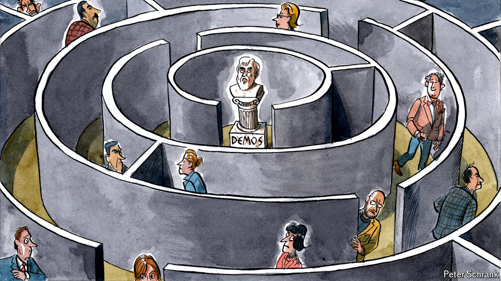

###### Charlemagne

# Europeans lack visceral attachment to the EU. Does it matter? 

##### In search of the missing European demos 

 

> May 2nd 2024 

In ancient Greece poetry was regulated so as to prevent excessive passions from corrupting the social order. Rhyming couplets have long since lost their ability to sway politics. And yet. On April 29th a small crowd in Aachen, a German town near the Belgian border, turned out for  in which amateur bards were asked to riff on, of all things, the European Union. A few dozen mostly grey-haired types, including Charlemagne (your columnist, not the medieval emperor who once ruled from the city), listened tactfully as a trio of youngsters rhymed one elongated compound word with another. Some light rapping was attempted. A local “TikTok political influencer”—not a profession Plato would have recognised—served as host and ensured the social order was indeed not corrupted (the risk seemed slim in retrospect). The lyrical battle having been settled amicably, the audience was treated to another Greek civic art. Streamed from down the road in Maastricht, eight politicians from Denmark, Luxembourg and beyond engaged in an old-fashioned contest of rhetoric ahead of the upcoming European elections on June 6th-9th.

To latter-day Aristotles, this half-filled theatre on a Monday night was a sign of another phenomenon with Greek roots: the emergence of a European , or common political culture. For centuries in Germany and beyond, civic life has been the stuff of municipalities, provinces or nation-states. Yet in Europe power is increasingly wielded by EU institutions in Brussels. Whether this centralising arrangement can be anything more than a souped-up intergovernmental body, a sort of regional UN on steroids, depends in part on whether citizens of countries across the EU viscerally feel they belong to the same polity. From such a unified  might emerge a unified European democracy. 

