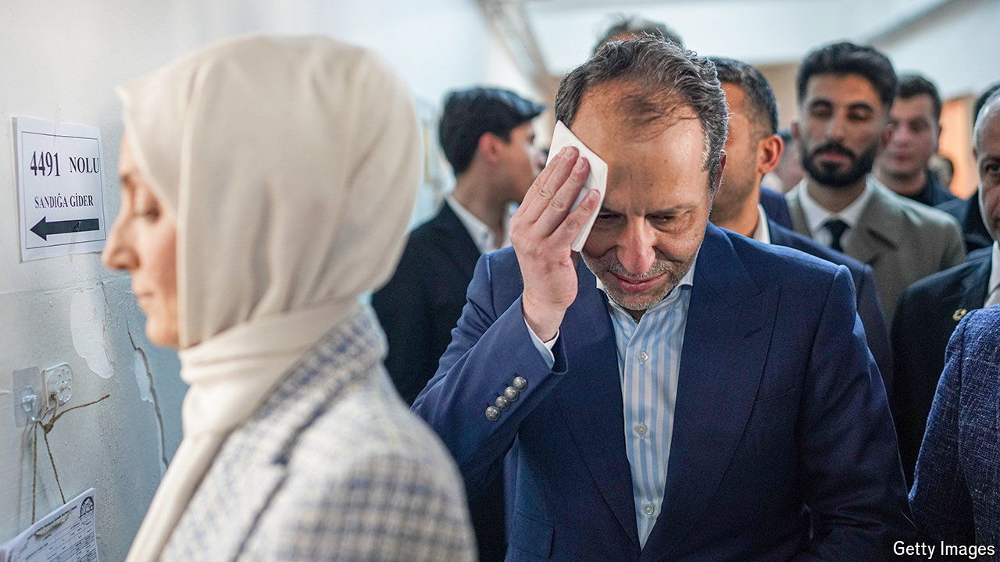

###### Holier than thou

# Turkey’s President Erdogan faces a new challenge from Islamists 

##### Religious voters think the president is not tough enough on Israel 

 

> May 2nd 2024 

THE CLAIM that Turkey’s president, Recep Tayyip Erdogan, has been too soft on Israel would surprise most observers. He is an outspoken defender of the Palestinians, and specifically of Hamas. Since the war in Gaza began seven months ago he has repeatedly accused Israel of genocide and called Binyamin Netanyahu, the country’s prime minister, a “butcher” and a war criminal. Some of Hamas’s leaders have found a haven in Turkey.

But for many religious hardliners, this is not enough. For months New Welfare, an increasingly popular Islamist party, has been giving Mr Erdogan grief. The party wants Mr Erdogan to freeze trade with Israel, close down a NATO radar station and deny American troops access to another NATO base in central Turkey. 

