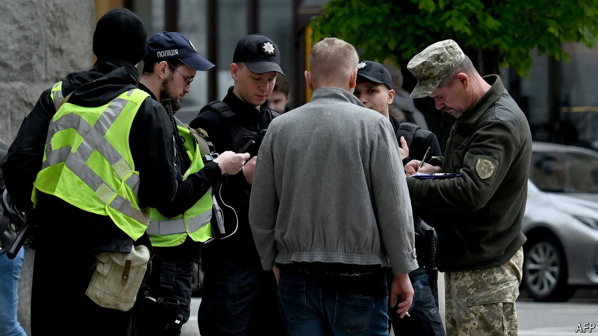

###### Don’t sign me up

# Ukraine’s draft dodgers are living in fear 

##### Ever more conscripts are needed against Russia’s offensive 

 

> Apr 28th 2024 

THE IDEA was madness, opening a bar in the throes of war. Russian  dominated Odessa’s horizon and the streets were barricaded with tank traps. Normal people were preserving whatever they had. But for a group of former philosophy students, it was the moment dreams were made and they poured everything into the project. By early summer 2022 they had refashioned a beauty salon into a new cultural hotspot, selling erotic photography and moonshine vodka. They mused about becoming partisans to fight the Russians should they ever appear. 

No one remembers exactly when the party stopped. It was a shock when the first young man from the group left the country. But then a second departed. Customers began vanishing, as the fear of being sent to the front lines grew. In late 2023 the bar’s owner escaped across the border with a medical exemption certificate that said he had diabetes. Ultimately only “Sasha”, the barman, remained.

