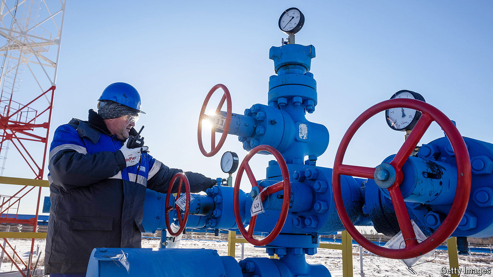

###### Down the pipe

# Russia’s gas business will never recover from the war in Ukraine 

##### Hopes of a Chinese rescue look increasingly vain 

 

> May 2nd 2024 

When Russia’s leaders stopped most of the country’s gas deliveries to the EU in 2022, they thought themselves smart. Prices instantly shot up, enabling Russia to earn more despite lower export volumes. Meanwhile, Europe, which bought 40% of its gas from Russia in 2021, braced itself for inflation and blackouts. Yet two years later, owing to mild winters and enormous imports of liquefied natural gas (LNG) from America, Europe’s gas tanks are fuller than ever. And Gazprom, Russia’s state-owned gas giant, is unable to make any profits. 

Russia was always going to struggle to redirect the 180bn cubic metres (bcm) of gas, worth 80% of its total exports of the fuel in 2021, that it once sold to Europe. The country has no equivalent to Nord Stream, a conduit to Germany, that allows it to pipe gas to customers elsewhere. It also lacks plants to chill fuel to -160°C and the specialised tankers required to ship LNG. Until recently, this was only a minor annoyance. Between 2018 and 2023 just 20% of the total contribution of hydrocarbon exports to the Russian budget came from gas, and despite sanctions Russia continues to sell lots of oil at a good price.

