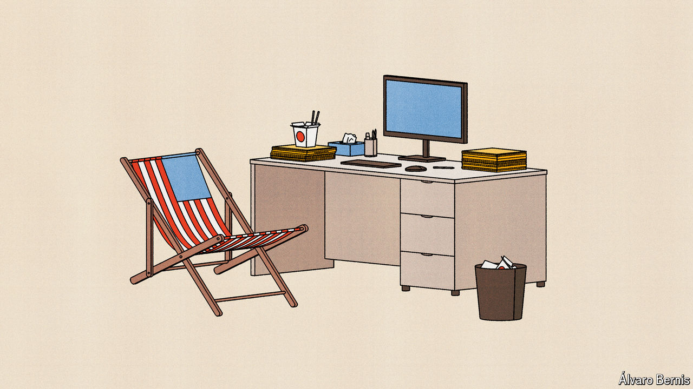

###### Free exchange

# Working from home and the US-Europe divide 

##### Americans are no longer the rich world’s great office drones 

 

> May 1st 2024 

When it comes to economic growth, America comfortably beats Europe. Many factors have fed America’s , from tech innovation to vast oil reserves. But there is one explanation that seems almost too simplistic: that “Americans just work harder”, as the head of Norway’s oil fund put it in an interview with the  on April 24th.

The numbers do in fact bear out this assertion—a rare case of national stereotypes being empirically provable. On average Americans work 1,811 hours per year, according to data from the OECD, a club of mostly rich countries. That is 15% more than in the EU, where the average is 1,571 hours. And it is not just that  spend a few extra weeks on the beach. The typical working day in Britain, France and Germany is half an hour shorter than in America, according to the International Labour Organisation. 

