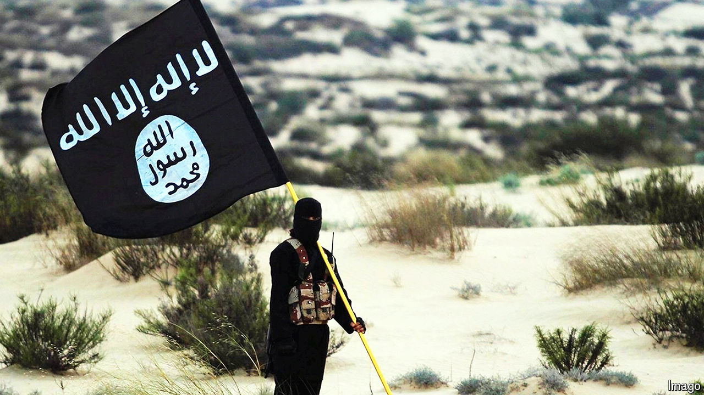

###### Killing at all costs

# Beware, global jihadists are back on the march 

##### They are using the war in Gaza to radicalise a new generation 

 

> Apr 29th 2024 

WHEN JIHADIST gunmen shot their way through Crocus City Hall in Moscow on March 22nd, killing more than 140 concert-goers and setting the venue alight, intelligence agencies across the West were aghast. It was the clearest warning that Islamic State (IS), seemingly smashed five years ago, is returning to spectacular acts of international terrorism. Western countries fear becoming targets.

The dread is deepest in France and Germany, which are hosting two of the world’s biggest sporting events this summer: the Olympic games and the Euro 2024 football championship. The floating ceremony along the Seine to open the Paris Olympics has been curtailed to limit the risk; a “Plan B” is in the works, too. “If you can do Moscow, you can do Paris,” explains Gilles Kepel, an expert on jihadism. “Moscow could be a training run for the Olympics.”

