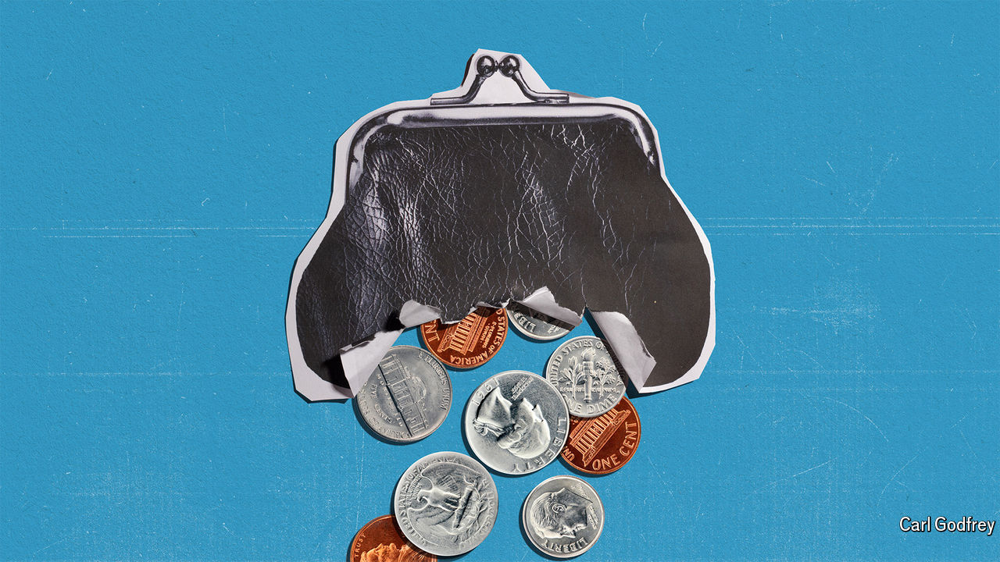

###### Uncle Sam’s fiscal folly

# America’s reckless borrowing is a danger to its economy—and the world’s 

##### Without good luck or a painful adjustment, the only way out will be to let inflation rip 

 

> May 2nd 2024 

If prudence is a virtue then America’s budget is an exercise in vice. Over the past 12 months the federal government has spent $2trn, or 7.2% of GDP, more than it has raised in taxes, after stripping out temporary factors. Usually such a vast deficit would be the result of a recession and accompanying stimulus. Today the lavish borrowing comes despite America’s longest stretch of sub-4% unemployment in half a century. The deficit has not been below 3% of GDP, an old measure of sound fiscal management, since 2015, and next year Uncle Sam’s net debts will probably cross 100% of GDP, up by about two-fifths in a decade. Whereas near-zero interest rates once made large debts affordable, today rates are higher and the government is spending more servicing the debt than on national defence. 

How has it come to this? The costs of wars, a global financial crisis and pandemic, unfunded tax cuts and stimulus programmes have all piled up. Both Republicans and Democrats pay lip service to fiscal responsibility. But the record of each side in office is of throwing caution to the wind as they indulge in extra spending or tax cuts. The biggest economic decision facing the next president is how generously to renew Donald Trump’s tax cuts of 2017, a step that will only worsen . 

