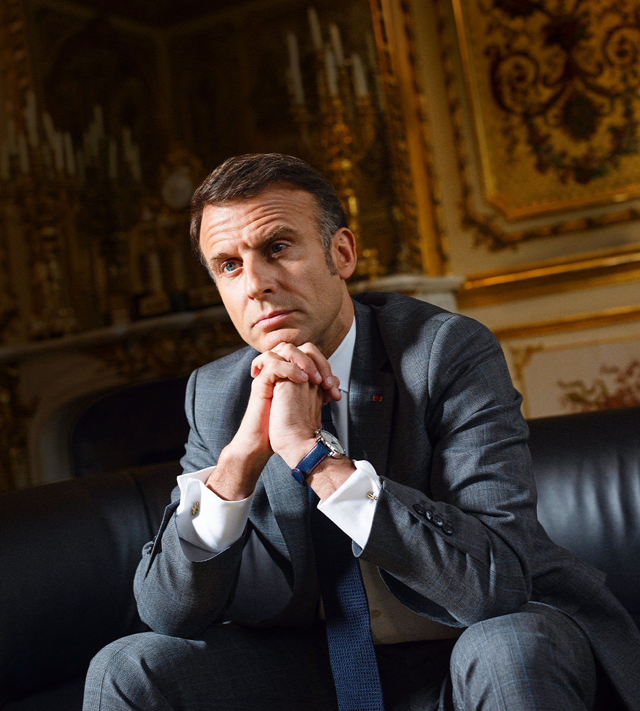

###### A region in mortal danger

# Emmanuel Macron’s urgent message for Europe 

##### The French president issues a dark and prophetic warning 

 

> May 2nd 2024 

IN 1940, AFTER France had been defeated by the Nazi blitzkrieg, the historian Marc Bloch condemned his country’s inter-war elites for having failed to face up to the threat that lay ahead. Today Emmanuel Macron cites Bloch as a warning that Europe’s elites are gripped by the same fatal complacency.

France’s president set out his apocalyptic vision in an in the Elysée Palace. It came days after his delivery of a big speech about the future of Europe—an unruly, two-hour, Castro-scale marathon, ranging from nuclear annihilation to an alliance of European libraries. Mr Macron’s critics called it a mix of electioneering, the usual French self-interest and the intellectual vanity of a Jupiterian president thinking about his legacy.

