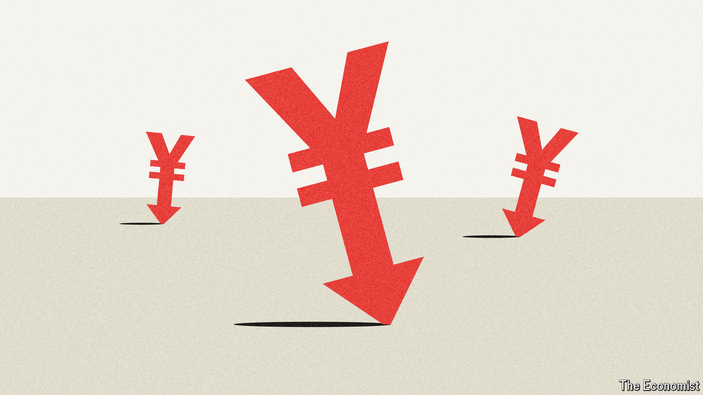

###### The haven falls

# Japan is wrong to try to prop up the yen 

##### Supporting the currency is expensive and futile 

 

> Apr 30th 2024 

It is easy for investors to lose a fortune in the financial markets—and even easier for governments. In 2022 Japan spent more than $60bn of its foreign-exchange reserves defending , its first intervention to strengthen the currency since 1998, after the exchange rate fell to nearly ¥146 to the dollar. And for what? Today the yen is weaker still. Yet instead of learning that fighting the market is futile, policymakers are repeating the mistake. After falling to ¥160 to the dollar on April 29th, its lowest in 34 years, the currency twice moved sharply upwards in the subsequent days. It seems the government is buying again, to the tune of tens of billions of dollars.

The yen has been falling primarily because of simple economic logic. The gap in interest rates between Japan and America is yawning. Although the Bank of Japan raised rates in March, it did so by only a smidgen: they increased from between minus 0.1% and zero to between zero and 0.1%. , by contrast, are more than five percentage points higher. Investors expect the gap to shrink a little over time, but not by much. As a result a ten-year Japanese government bond yields just 0.9%, compared with 4.6% for an American Treasury of the same maturity.

