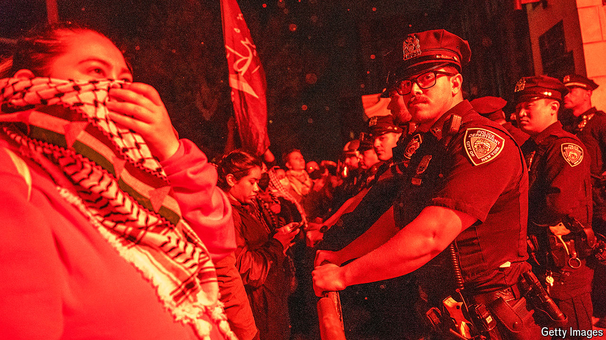

###### All talk

# Should American universities call the cops on protesting students? 

##### The principles involved in resolving campus protests are not that hard 

 

> May 1st 2024 

Flashbangs to CLEAR occupied buildings, helmet-wearing police officers and handcuffed students: the scenes at Columbia and other  seem like a throwback to a rougher age. More than 1,500 students have been arrested around the country so far, and the number will probably rise in the coming weeks. For college presidents this is nightmarish. Members of Congress are trying to get them fired for indulging antisemitism; donors threaten to withdraw funding; they are supposed to be guardians of free speech and are also expected to create an environment that fosters learning and inquiry. Some outside agitators are showing up, hoping for a fight. The students, both pro-Palestinian protesters and those offended by the protests, are paying customers. And members of the faculty all think they could do a better job than the hapless administrators.

As a practical question, dealing with these protests is hard. As an intellectual question, the sort debated on college campuses, it really is not. And yet clever people are tying themselves in knots over the rights and wrongs of what is going on. To the right are politicians who have spent years denouncing elite universities for being full of snowflakes who cannot bear exposure to different opinions, and are now trying to stretch the definition of antisemitism to silence views they disagree with, preferably with the help of the National Guard. To the left are students, faculty and administrators who have embraced the idea that objectionable speech is the same as violence, and are now arguing that it is fine for people to wave banners that call for actual violence (for example, “Globalise the intifada!”).

