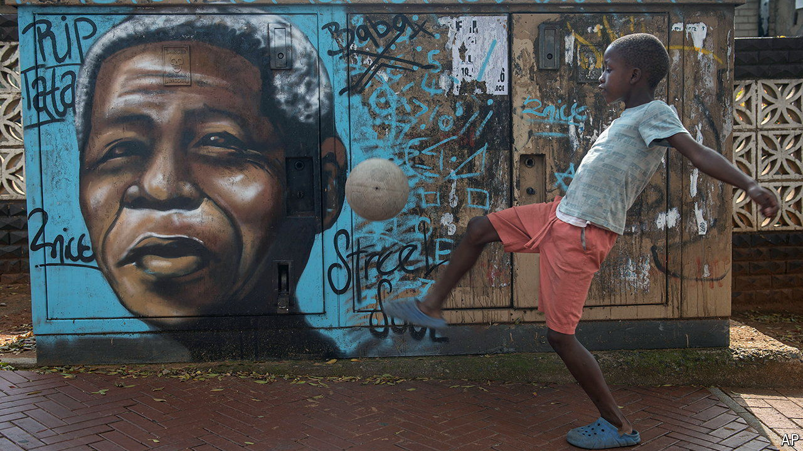

###### The dream that darkened

# Why South Africans are fed up after 30 years of democracy 

##### After a bright start the ANC has proved incapable of governing for the whole country 

 

> May 2nd 2024 

Almost 30 years ago, on May 10th 1994, Nelson Mandela was inaugurated as South Africa’s first black president. A fortnight earlier he and millions of other black South Africans had voted for the first time in their lives. Internationally, the joyous scenes were seen as further proof, following the fall of the Soviet Union, that the world was moving in a democratic direction after a dark 20th century.

As South Africa prepares for its seventh multiracial general election on May 29th, it can be proud. That vote will be free and fair. The liberal institutions established under Mandela are bulwarks against abuses of power. Millions of black South Africans have marched from apartheid into the middle class. 

