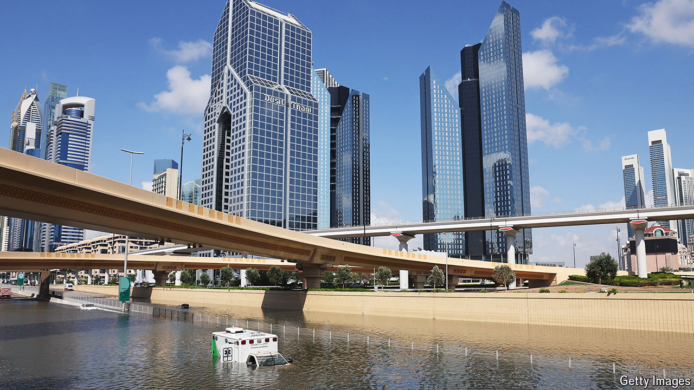

###### How Gulf states rule

# Gulf governments are changing, but not how they talk to citizens 

##### Rumours about downpours in Dubai and rosé in Riyadh stem from a lack of trust 

 

> May 2nd 2024 

IT WAS a very Dubai apocalypse. As your correspondent tried to reach the city’s main motorway on April 16th, a chauffeured BMW was inching along the same on-ramp, by then more river than road. It looked to be ferrying a business-class passenger to the airport. But there would be no free-flowing Moët et Chandon in the lounge that day: the car was soon submerged in floodwaters and came to a stop.

Last month’s deluge dumped 142mm (5.6 inches) of rain on Dubai, one and a half times the city’s average annual rainfall. The airport tarmac was engulfed, leaving thousands of passengers trapped at the world’s busiest international hub. Stranded motorists abandoned cars for days on flooded roads across the United Arab Emirates (UAE), the seven-member federation of which Dubai is a part. Unable to get home, workers and shoppers slept on the floors of shopping malls.

