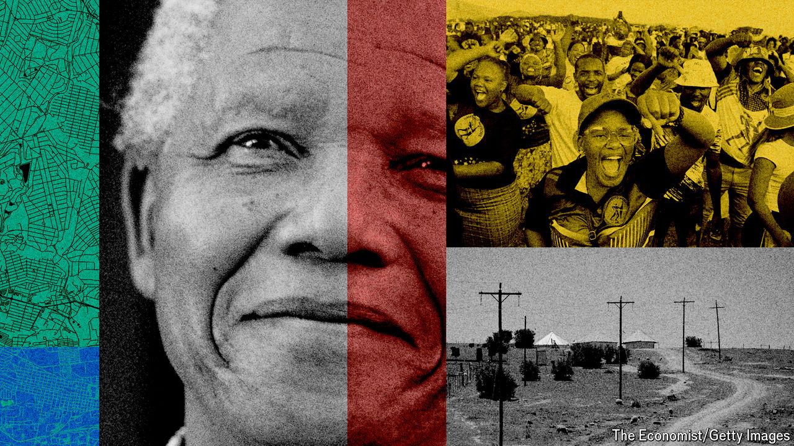

###### Democracy’s dividends

# How South Africa has changed 30 years after apartheid 

##### Poverty is rife and inequality still starkly racial 

 

> May 2nd 2024 

Nelson Mandela voted for the first time in his life on April 27th 1994 in Inanda, a poor area on the hills above the city of Durban. The choice of location showed that South Africa’s president-in-waiting had lost none of his knack for symbolism after his 27 years as the world’s most famous political prisoner. After casting his ballot Mandela walked to the nearby grave of John Dube, the first president of his party, the African National Congress (ANC). “I have come to report, Mr President,” he said in his resonant timbre, “that South Africa is now free.” 

Thirty years later South Africa is undeniably a free country. The hidebound evil of apartheid is gone. A liberal constitution helps ensure South Africans can say what they want, move where they like and marry whom they love. A basic welfare state has raised millions out of indigence. South Africans socialise more with people of other races. More than three-quarters say that there is more that unites them than divides them, according to the South African Reconciliation Barometer Survey (SARBS), a biennial poll. Elections on May 29th will be free and fair. 

