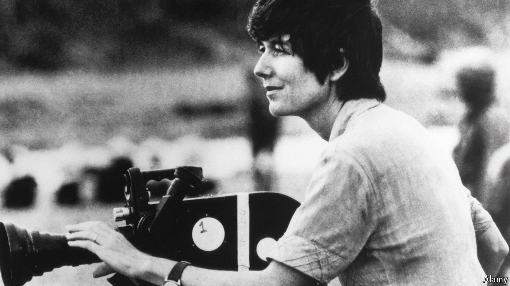

###### Inside “Apocalypse Now”

# Eleanor Coppola recorded how a cinematic triumph almost came unstuck 

##### The documentary-maker and wife of Francis Ford Coppola died on April 12th, aged 87 

 

> May 2nd 2024 

The downdraught of the helicopter’s rotor blades, as it landed, blew her and her tripod sheer off the ground. Smoke from earth-shaking explosions shut down her view entirely. A trek through a rice paddy ended with the camera almost being sucked under. The firing of four thatched huts by the special-effects department destroyed the prop store where she kept her gear; her camera cases lay in the doorway, melted. Yet Eleanor Coppola took it all in her stride. She was so elated to be usefully working, recording the disaster-every-minute making of her husband Francis’s “Apocalypse Now”, that this was a small price to pay. 

It was his film of course, one he had mortgaged their house to pay for. But it was also hers. He, with hundreds of extras, tons of explosives and military hardware loaned, then snatched back, by the Philippines government, was shooting the story of Captain Ben Willard, sent during the Vietnam war to close down an operation run from Cambodia by Colonel Kurtz, a rogue Green Beret. She, with her simple single-lens camera, filmed behind the scenes to show the logistical emergencies, winds and floods, personality clashes and script rehashes that went on day by day. His film, released in 1979, was nominated for eight Oscars and won two. Hers, when it appeared 12 years later (part-edited by her, with her narration and the title “Hearts of Darkness”) won six nominations and an Emmy. It was the best piece of art she ever made.

