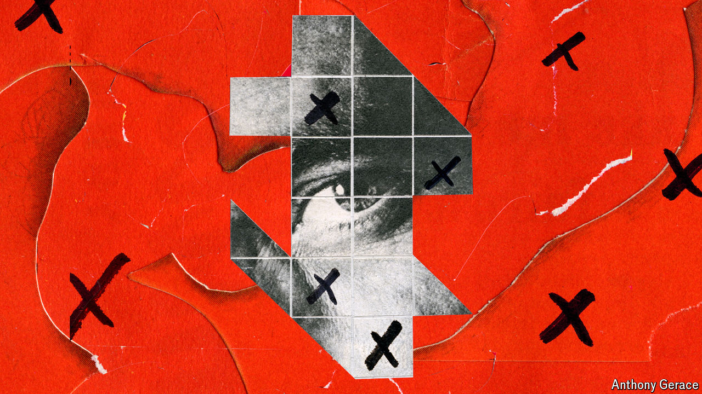

###### A steep hill

# Fighting disinformation gets harder, just when it matters most 

##### Researchers and governments need to co-ordinate; tech companies need to open up 

 

> May 1st 2024 

In February 2024 America’s State Department revealed that it had uncovered a Russian operation designed to discredit Western-run health programmes in Africa. The operation included spreading rumours that dengue fever, a mosquito-borne illness, was created by an American NGO, and that Africans who received treatment were being used as test subjects by American military researchers. The campaign, based around a Russian-funded news site, was intended to sow division and harm America’s reputation. Discouraging Africans from seeking health care was collateral damage along the way.

The campaign was brought to light through the work of the Global Engagement Centre, an agency in the US State Department. Once a false story is detected, the agency works with local partners, including academics, journalists and civil-society groups to spread the word about the source—a technique known as “psychological inoculation” or “pre-bunking”. The idea is that if people are made aware that a particular false narrative is in circulation, they are more likely to view it sceptically if they encounter it in social-media posts, news articles or in person.

