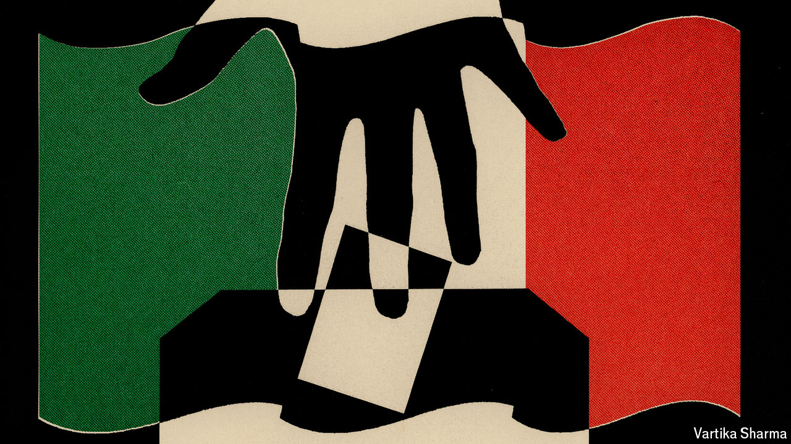

###### Mexico’s presidential election

# Andrés Manuel López Obrador will haunt his successor 

##### Mexico’s next president will struggle against gangs, poverty and migration 

 

> Apr 30th 2024 

The scourge of the blockbuster remake has come for the world’s seventh-largest democracy. Mexico’s second presidential debate took place (appropriately) at Churubusco film studios in Mexico City, the capital, on April 28th. The main question was whether Mexicans want a sequel to the six-year feature that  has scripted, directed and starred in. 

, the candidate for the ruling Morena Party, said Mexicans face a choice between “advancing with the transformation” started by her mentor, Mr López Obrador, or returning to a “past of corruption and privileges” with Xóchitl Gálvez, who leads a coalition of opposition parties. Ms Gálvez presents herself as the candidate to rescue Mexico from Mr López Obrador’s incompetence and his attacks on democracy. Voters will decide on June 2nd. They will also choose representatives for tens of thousands of local posts, nine governors and all 628 seats in Congress.

