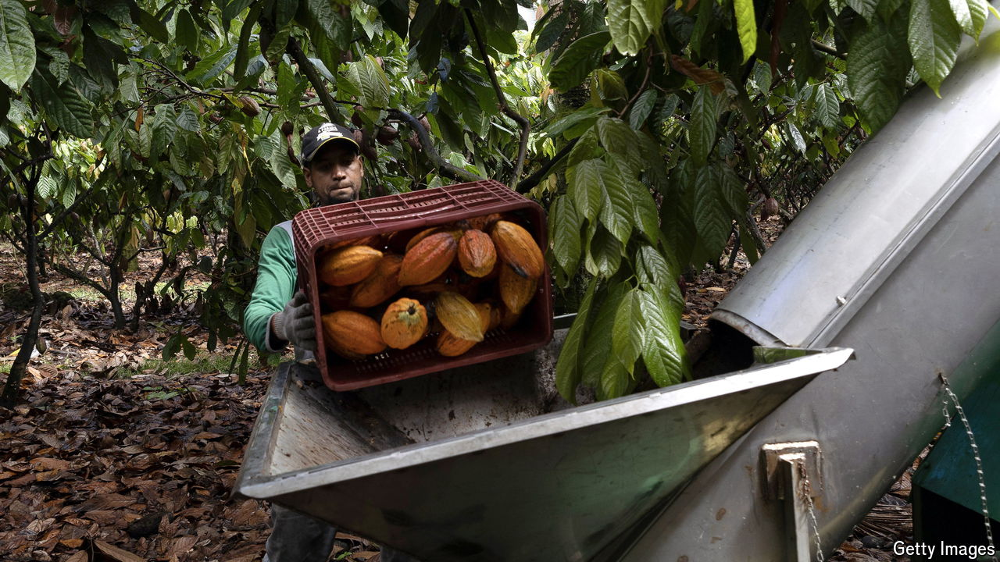

###### Cuckoo for cocoa’s price

# Latin America’s farmers are cashing in on hot hot cocoa prices 

##### They aim to spend the windfall improving their technology to expand production 

 

> May 2nd 2024 

The latest El Niño weather cycle has ended. Latin America’s farmers are assessing the damage. It is mostly bad news. Many places flooded, while others suffered extreme heat and drought. Harvests of most staples have been meagre. Falling prices have added insult to injury, eroding farmers’ profits. 

But cocoa, the core ingredient in chocolate, is bucking the trend. Output has risen in Ecuador and Brazil, the region’s two largest growers, as well as in countries like Peru, Colombia and the Dominican Republic, which produce less. That is mostly down to luck. The areas where cocoa is grown, such as the coastal provinces in Ecuador and north-eastern Brazil, escaped the worst of the weather.

