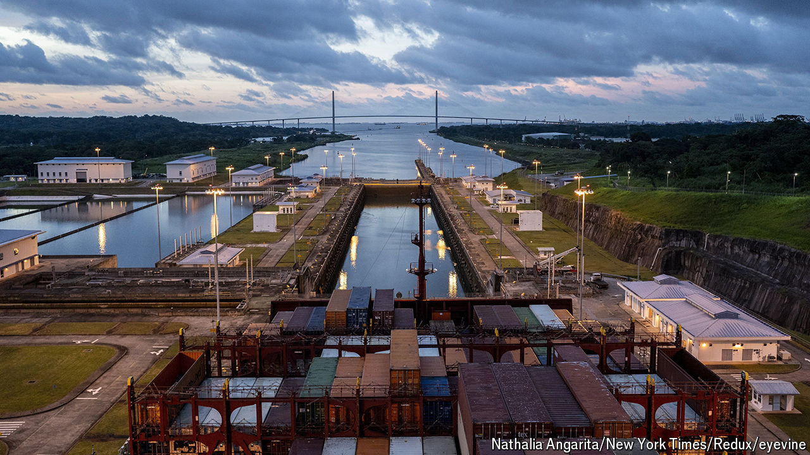

###### The mine and the canal

# Years of growth forged prosaic politics. Now Panamanians are fed up 

##### They will elect a new president on May 5th 

 

> May 2nd 2024 

Panama’s elections are unusual. Turnout averages 75%. More than half of the country’s voters are affiliated with a political party, most of which are centre-right and pro-business. Strong economic growth, which averaged 5.9% over the 20 years after the country took ownership of the Panama canal at the turn of the century, led to calm politics. With few ideological snags, politicians could choose the party which suited them best. “Panama’s political parties are like baseball teams,” says R.M. Koster, a journalist and novelist from the United States who has lived in Panama since the 1950s. “They play the same game and the star players switch between them.” 

But now Panamanians are fed up. The canal’s water levels are dwindling, threatening flows of trade and government revenue. Billions of dollars must be spent on dams or underground pipes to keep it full. A giant copper mine on the north coast has been forced to close, costing 30,000 jobs; the mine accounts for 5% of GDP once its indirect effects are included, according to Fitch Ratings. Years of fiscal mismanagement and corruption mean two-thirds of Panamanians now desire “radical change”, according to a local poll published in 2023. Some 83% say they are dissatisfied with their democracy. They go to the polls to elect a new president on May 5th.

