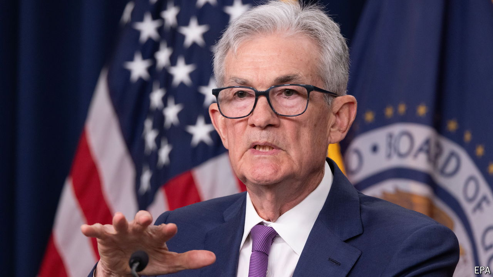

###### The world this week

# Business 

#####  

 

> May 2nd 2024 

The made it official and declared there had been a “lack of further progress” in getting inflation down to its 2% target, suggesting that it won’t start cutting interest rates until much later this year at the earliest. In January investors were pricing in about six quarter-of-a-percentage-point cuts in 2024. They have pared their bets since.

The  rebounded sharply, fuelling speculation that the authorities had intervened to prop up the currency for the first time since 2022. The currency had hit a 34-year low of 160 to the dollar, after the Bank of Japan left its benchmark interest rate on hold at between zero and 0.1%, having raised it from minus 0.1% in March. The central bank gave little clue as to when it would raise rates again, and also did not produce a plan to sharply curtail its bond-buying.

