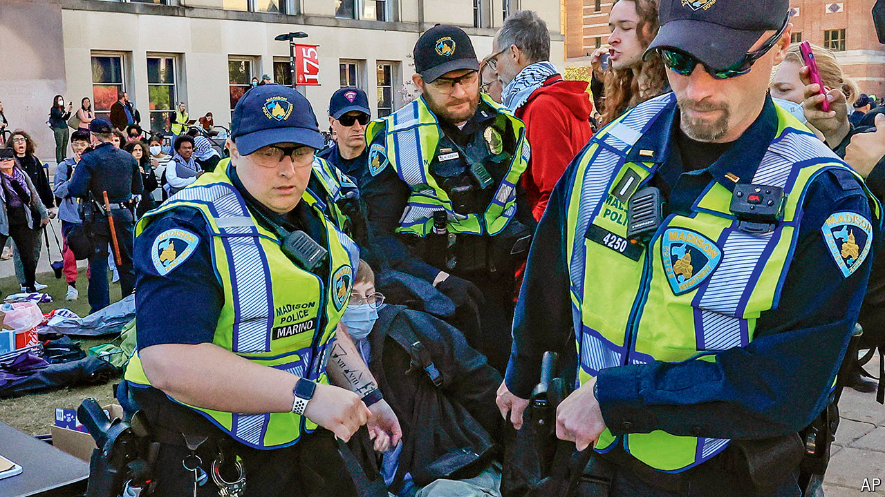

###### The world this week

# Politics 

#####  

 

> May 2nd 2024 

More American colleges were swept up in pro-Palestinian . Pro- and anti-Israel students clashed violently at the University of California, Los Angeles; Jewish students said earlier that they had been turned away from the campus by protesters. Hundreds of arrests were made across the country, including at the University of Texas in Austin and at Columbia, where students had occupied a building. The University of Florida said agitators who disrupted college life would be banished. Many students have tried to set up tent encampments. At the Sorbonne in Paris police moved swiftly to stop a copycat camp from being set up. 

Four  were killed and four wounded in Charlotte, North Carolina, during a shoot-out as they served an arrest warrant. Last year 46 officers were shot dead in the line of duty in America, though that was a sharp fall from the 64 killed in 2022. 

