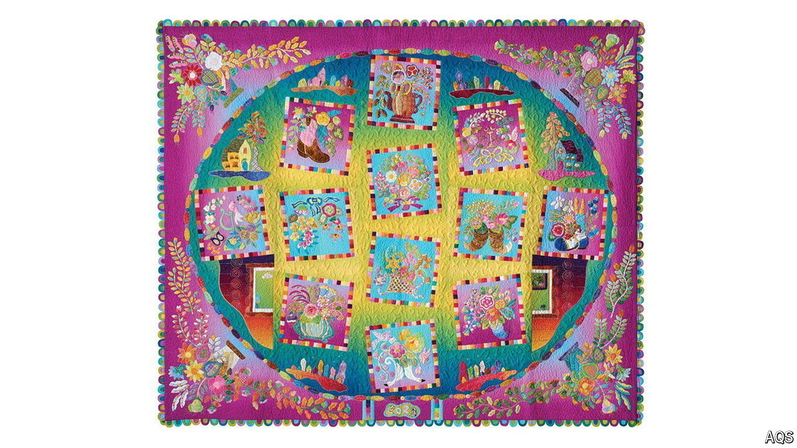

###### Joined by a thread

# A surprising Japanese presence in a traditional American craft 

##### Quilting connects continents 

 

> May 2nd 2024 

As American as baseball and apple pie. That is the perception many people have of the craft of quiltmaking—not without reason. In “The Little House on the Prairie”, an iconic book series depicting the life of settlers in the Midwest in the 1870s, Laura and Mary learn patchworking skills as children. American quilts from the 19th and 20th centuries often have a patriotic flair, some even adorned with portraits of presidents. Scores of handmade quilts are catalogued in the Library of Congress.

A grand part of the tradition of quilting in America are its annual quilt shows. These evolved from county fairs but are now huge stand-alone events. Alongside the meticulously stitched quilts, submitted for prizes, are everything hobbyists might need for their efforts. That includes not just thread and yards of colourful fabric, bundled up into “jelly rolls”, “fat quarters” and “layer cakes” (all of which can help a quilter produce distinctive works), but also $12,000 movable long-arm quilting machines, the size of dining tables, which enable the user to quilt designs as easily as they might paint a canvas. 

