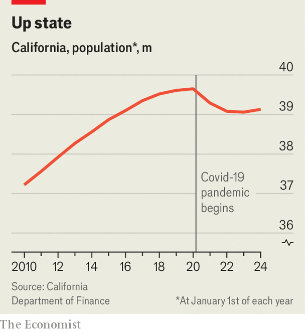

###### Going back to Cali

# California’s population is growing again 

##### The pandemic doldrums are over 

 

> Apr 30th 2024 

IT WAS THE end of an era. In 2020 California’s population shrank for the first time since it joined the union in 1850. People had flocked to the state for its farmland, beaches and IT industries. When falling birth rates, lower immigration, outmigration to cheaper states and the covid-19 pandemic reversed that trend, California had a bit of an identity crisis. But figures released on April 30th by California’s Department of Finance should lessen the hand-wringing. In 2023 California’s population grew by nearly 0.2%, or about 67,000 residents (see chart). 

 


