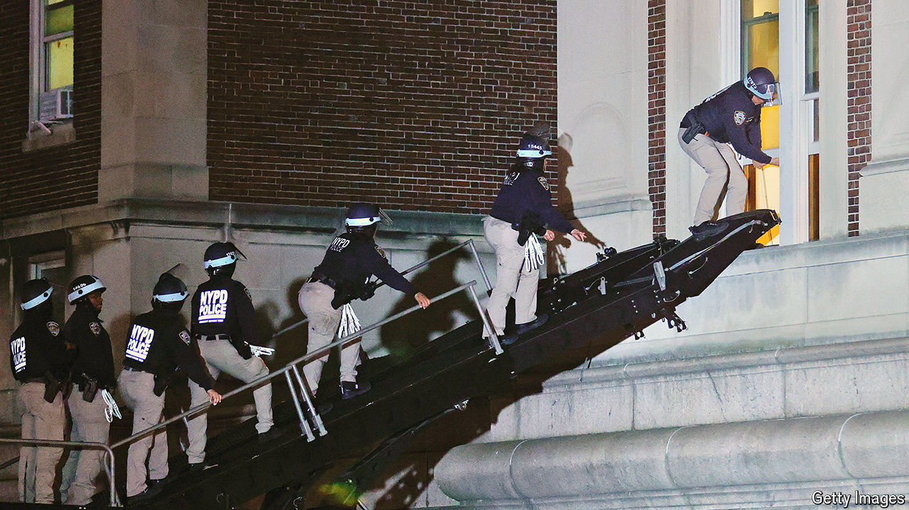

###### Blooming encampments

# Escalating protests expose three fault lines on American campuses 

##### Universities struggle with how to regulate free speech and other rules 

 

> Apr 30th 2024 


PRO-PALESTINIAN protests and police crackdowns are escalating at American universities. A phalanx of New York police with battering-rams entered Columbia University on the night of April 30th, joined by an armoured vehicle with an elevated ramp known as a BearCat, a cross between a tank and a fire engine. They breached a building occupied by demonstrators, arrested more than 100 students and other protesters and led their zip-tied detainees onto police buses. 

