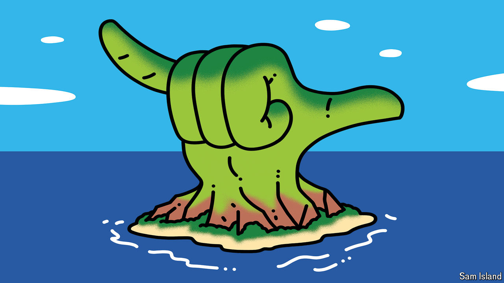

###### Shaka backer

# Hawaii may soon have America’s first official state gesture 

##### It would join the shag, the whoopie pie and other state symbols across the country 

 

> Apr 30th 2024 

On May 1st Hawaiian legislators voted to send a bill to Governor Josh Green that would make the shaka—the “hang loose” gesture—a state symbol. Hawaiians and surfers use the hand signal (made by folding three fingers down while extending the thumb and little finger, and sometimes twisting the wrist) in many ways: to say aloha, for instance, or let someone pass while driving. “I would describe it as a symbol of happiness,” said Glenn Wakai, the state senator who introduced the bill. It sailed through the legislative process. If the governor signs it into law, it will be America’s first official state gesture.

It would join a rich and varied list of symbols across the country—more than 1,670 in all, a cornucopia of flora, fauna and cultural exotica. Maine has a state treat, the whoopie pie. South Carolina has a style of dance, the shag. State reptiles abound, from the horned toad (Wyoming) to the collared lizard (Oklahoma). New Mexico even has an official state aroma, the smell of “green chile roasting in the fall”. 

