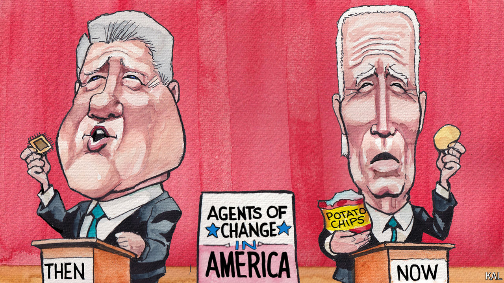

###### Lexington

# Joe Biden is practising some Clintonian politics 

##### But he needs to do more than crack down on “junk fees” to woo swing voters 

 

> May 2nd 2024 

President Joe Biden says he is in a battle for the soul of America. He is out to save democracy at home from Donald Trump and abroad from Vladimir Putin of Russia and Xi Jinping of China. Mr Biden also wants to restore America’s manufacturing, rebuild its infrastructure, bring peace to the Middle East and confront climate change. And yet none of that seems to mean quite as much to most Americans as when he starts railing about finding fewer potato chips in a bag than he used to. 

Mr Biden and his aides are putting new emphasis on his efforts to fight what he calls junk fees and shrinkflation—the underhanded means, in his view, by which businesses surprise consumers with higher prices or less stuff, such as potato chips, than they expect. Unlike almost anything else Mr Biden says or does, combating such costs draws overwhelming bipartisan support. 

