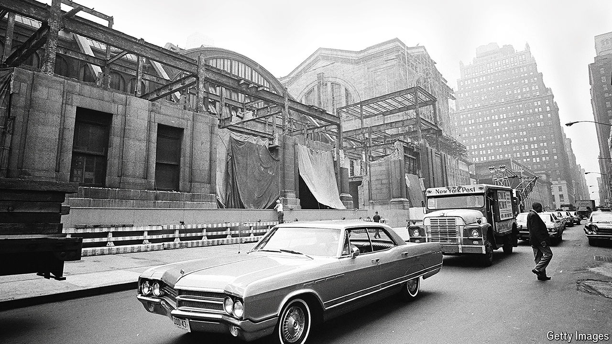

###### The Big Grapple

# Seaport Tower shows New York’s fight between housing and heritage 

##### Can the city build its future without destroying its past? 

 

> May 2nd 2024 

There is nothing beautiful about 250 Water Street, a derelict car park in Lower Manhattan. But it is in the historic low-rise district of Seaport, an old fishing quarter, which was designated a landmarked area in 1977. The site is the focus of a legal row over a project dubbed the “Seaport Tower”, which has pitted preservationists against developers.

The context is New York’s dire lack of housing. In February the city’s triennial housing survey revealed a rental vacancy rate (the proportion of available housing unoccupied) at a historic low of 1.4%. The Seaport Tower, which would soar to 324 feet, higher than the Flatiron Building, would bring 270 new housing units in a convenient part of town. But at what cost?

