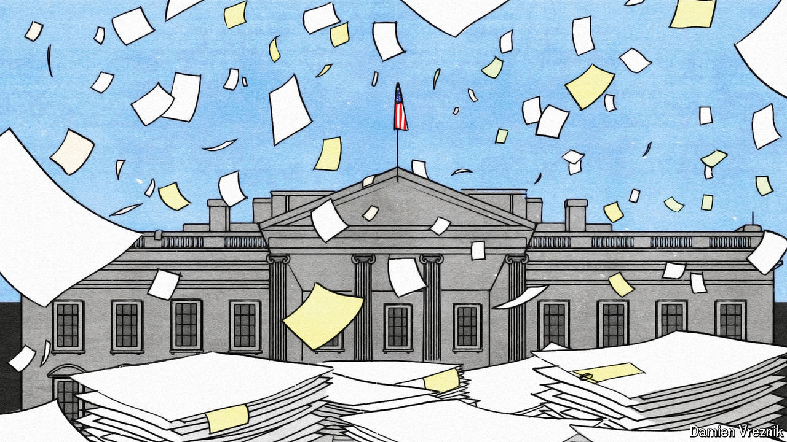

###### It’s raining rules

# Why the Biden administration is rushing to produce regulations 

##### An obscure law creates pressure to issue rules that can’t be undone in a hurry 

 

> May 2nd 2024 

The bureaucrats have been busier than usual lately. Consider the three days between April 23rd and April 25th. The Federal Trade Commission (FTC) issued a sweeping rule banning non-compete clauses in the contracts of almost all American employees. The Department of Labour is expanding the set of workers who must receive mandatory overtime pay (to those who make less than $58,656 a year). The Environmental Protection Agency issued strict guidelines on coal-fired power stations that will probably spell their demise by 2039. 

More regulations, big and small, are expected soon. The Federal Energy Regulatory Commission is planning to rewrite the rules governing interstate electricity transmission, which is critical to President Joe Biden’s decarbonisation plans. A different agency, the Department of Energy, is debuting new efficiency standards for dishwashers and water heaters. The Department of Justice is expected soon to propose classifying marijuana, which at the moment is lumped in the same class of substances as heroin and LSD, as a less dangerous drug.

