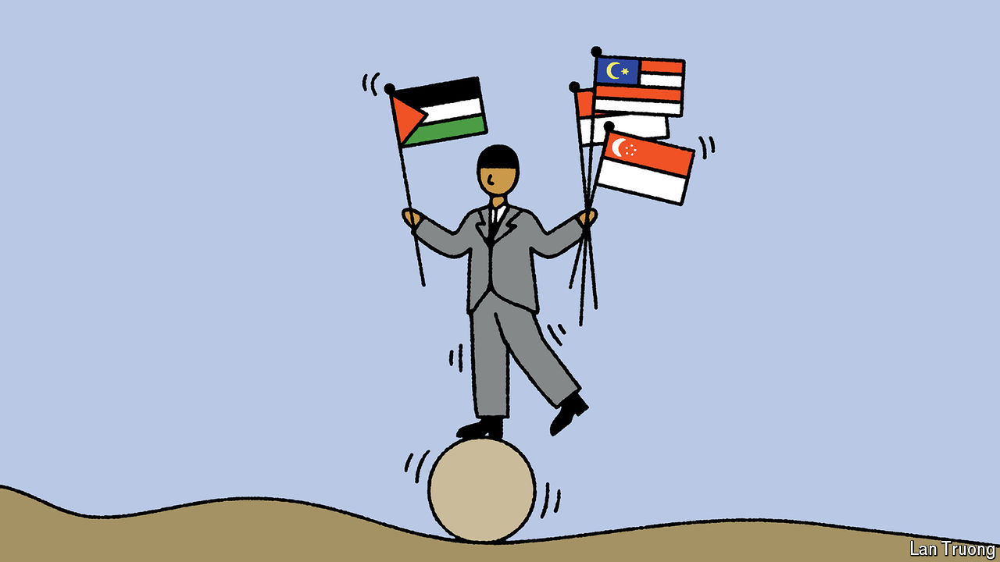

###### Banyan

# In South-East Asia, the war in Gaza is roiling emotions 

##### The governments of Indonesia, Malaysia and Singapore have responded very differently 

 

> May 9th 2024 

FAR MORE than Russia’s invasion of Ukraine, the war in Gaza is rattling public opinion in three key South-East Asian countries: Malaysia, Indonesia and Singapore. The first two have Muslim-majority populations, and Singapore, largely ethnic-Chinese, has a Muslim minority of 16%. As on campuses in America and in street protests in Europe, the sympathies among those who are concerned about the conflict—and who in Singapore include many young non-Muslims—are for Palestinians suffering from Israel’s heavy-handed prosecution of the war. 

Strong feelings have thus made the war a political challenge in ways that are connected, but also vary from country to country. Malaysia’s prime minister, Anwar Ibrahim, is by far the most strident leader in South-East Asia in support of the Palestinians. Mr Anwar has decried what he says was Western pressure to condemn Hamas, the hardline group ruling Gaza that started the war with a brutal raid on Israel. 

