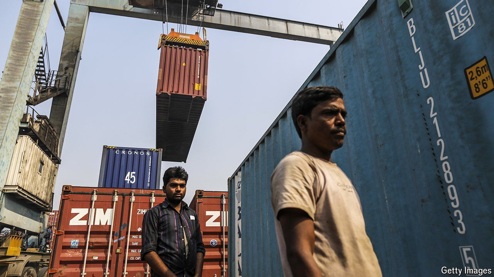

###### Out of the blue

# India has quietly transformed its ports 

##### That is good for trade, and a good sign for reform 

 

> May 9th 2024 

IF THERE IS one thing about which both supporters and critics of Narendra Modi, India’s prime minister, can agree, it is that his biggest achievement has been to overhaul India’s infrastructure. Tens of thousands of miles of motorways have been built, fast intercity trains have been waved off, dozens of urban  have opened and  on more aircraft through more airports than ever before. These are impressive feats. 

There is deeper transformation going on behind the scenes, too, in sectors with which most Indians have no direct contact but which affect their lives all the same. One of these is ports, which have seen huge improvements in capacity and efficiency. This is crucial for India’s economic aims: Mr Modi’s government harbours ambitions of making India a manufacturing and export hub as well as a node in global supply chains. World-class ports are necessary to realise those goals. The maritime sector accounts for 95% of India’s trade by volume and 65% by value. 

