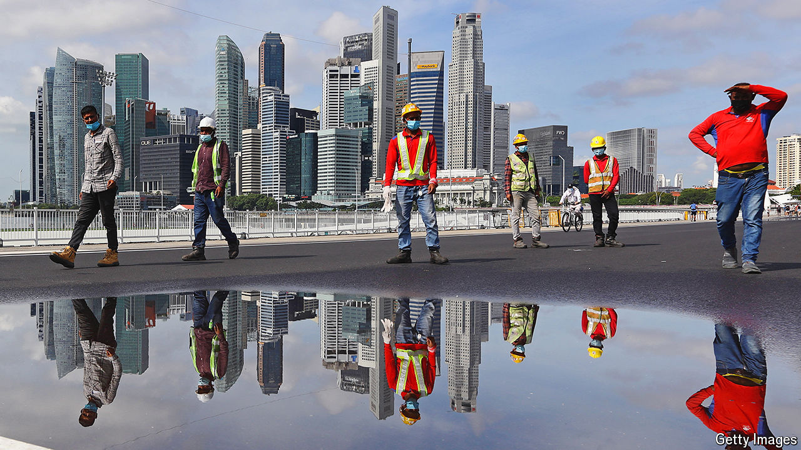

###### The view from the top

# Singapore has achieved astounding economic success 

##### Can Lawrence Wong, its incoming PM, oversee further growth? 

 

> May 8th 2024 

Since its independence almost 60 years ago, Singapore has become a beacon of prosperity. In a part of the world where middle-income status is the norm, the city-state is now the richest country for many thousands of miles in any direction. At around $88,000, its GDP per person has doubled in real terms over the past 20 years. At the moment of its independence in 1965, the country was poorer on the same basis than South Africa or Jordan.

But as the world looks at globalisation with increasing scepticism, balancing Singapore’s domestic politics against its role as a global city will become trickier. “The established norms are eroding,” says Lawrence Wong, Singapore’s incoming prime minister,  on May 6th. “People are searching for new bearings, but the new order is not yet established. I think it will be messy for quite a few years, maybe a decade or longer.”

