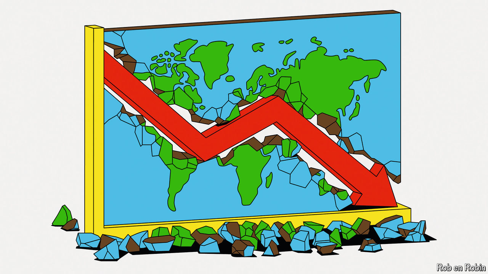

###### The great regression

# The world’s economic order is breaking down 

##### Critics will miss globalisation when it is gone 

 

> May 9th 2024 

IN LATE APRIL, for the 75th time in a row, America blocked a mundane motion at the World Trade Organisation to fill vacancies on the panel that is the final arbiter of disputes among the group’s members. The relentless vetoes, obscure as they might sound, have in effect completely defanged the WTO for almost five years. Members that are found to have violated its rules can simply appeal against the decision, to a panel that is not functioning for lack of personnel. While the appeals moulder, the transgressions go unpunished. Two years ago, at one of the WTO’s biennial summits, members resolved to get the dispute-resolution mechanism up and running again by this year. At the latest summit, earlier this year, having failed to do so, they instead decided, without even a hint of irony, to “accelerate discussions”.

The dysfunction at the WTO is emblematic of a world where the institutions and rules intended to foster international trade and investment are falling into abeyance. Every day brings alarming new headlines. The European Union, although supposedly both more supportive of free trade and more determined to reduce its greenhouse-gas emissions than other economic powers, is on the verge of imposing duties on Chinese electric vehicles. Last month EU officials raided a big Chinese security-equipment maker as part of a probe into subsidies. America recently imposed sanctions on more than 300 entities, including some in China and Turkey, for providing support to Russia’s armed forces.

