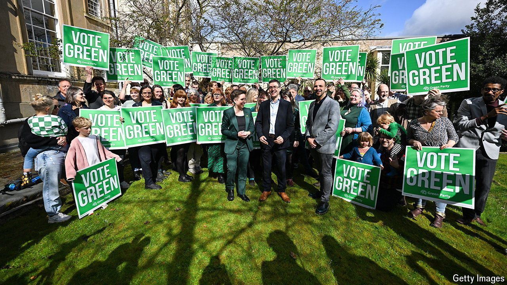

###### The Green Party

# Could the Greens become a force in British politics? 

##### The party hopes to win over voters to the left of Labour 

 

> May 9th 2024 

The Green Party of England and Wales has a colourful history. Its co-founder, Tony Whittaker, a solicitor and former Tory councillor from Coventry, claimed to have been inspired by an interview inmagazine with Paul Ehrlich, a biologist and population alarmist. Ahead of the October 1974 election, the budding party’s “manifesto for survival” suggested that the ideal family size was “one or a maximum of two children” and proposed “freely available” sterilisation to help Britain shrink its population. It won a grand total of 2,000 votes. 

Fifty years on, the party has changed its policies and raised its profile. In local elections on May 2nd it gained 74 council seats, bringing its tally to 812 councillors in England and Wales. It is polling at a  of the vote nationally. At a general election later this year the Greens will be held back by Britain’s first-past-the-post electoral system. They won almost 840,000 votes at the last election in 2019 and ended up with just one seat; they will do well to double their seat count this time round. But other parties, from UKIP to , have had an impact on the right wing of British politics that did not depend on having seats in Westminster. The Greens may end up having a similarly outsize effect on disaffected voters on the left.

