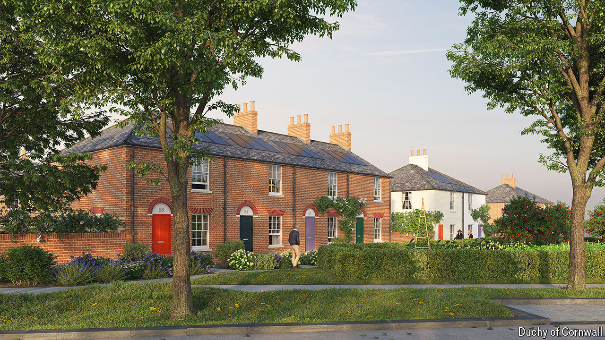

###### Urban planning in Britain

# Now it’s Prince William’s turn to shape British town planning 

##### What the Duchy of Cornwall builds today, others will build tomorrow 

 

> May 7th 2024 

Let a man linger close to the British throne and his mind will eventually turn to architecture. In between drinking and gambling sessions, the prince regent who became George IV commissioned the loopy Royal Pavilion in Brighton. Prince Albert had “a wonderful turn for architecture”, in the fond estimation of his wife, Queen Victoria. Charles III began to pronounce on the subject in the mid-1980s, to many actual architects’ chagrin. 

Now it is the turn of Charles’s son. By contrast to his father, Prince William has said little of note about architecture or planning, or indeed anything at all. But as first in line to the throne he is the Duke of Cornwall, which means he oversees 52,449 hectares of land. In one plot far from Cornwall, on the edge of Faversham in Kent, the duchy is seeking permission to build thousands of homes. If the local council agrees, it may affect the whole country. The Duchy of Cornwall draws attention, partly because of its royal sheen and partly because it can build more lavishly and slowly than a commercial outfit. What it builds today, other British developers have a habit of building tomorrow.

