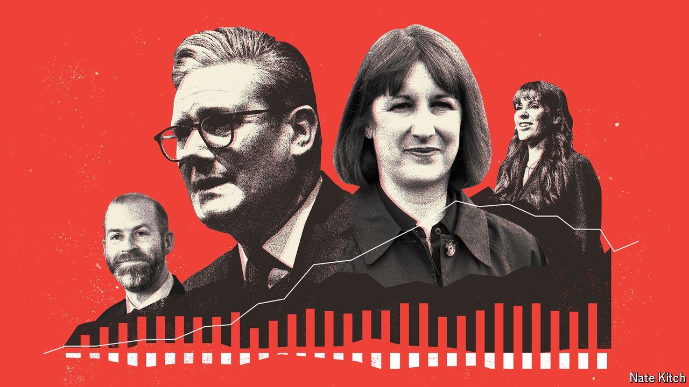

###### A new deal

# The Labour Party’s grand bargain with business 

##### What would a new British government mean for boardrooms? 

 

> May 9th 2024 

EARLIER THIS year the Labour Party hosted business leaders for a day of hobnobbing at the Oval cricket ground in London. A representative from Skanska, a construction company, challenged Jonathan Reynolds, the party’s shadow business secretary. Problems with big infrastructure projects had dented Britain’s attractiveness, she said. What could she tell her board in Sweden to make them re-evaluate? Mr Reynolds’s reply: he would go to Stockholm himself to make the pitch.

That moment captured the Labour Party’s striking courtship of business under the leadership of Sir Keir Starmer. Between them, Sir Keir, Mr Reynolds and Rachel Reeves, the shadow chancellor, have now met almost all the FTSE 350, Britain’s largest listed firms, in a cycle of breakfasts that the party has dubbed the “smoked salmon offensive” (a nod to the “prawn cocktail offensive” that saw Sir Tony Blair court the City before taking power in 1997). 

