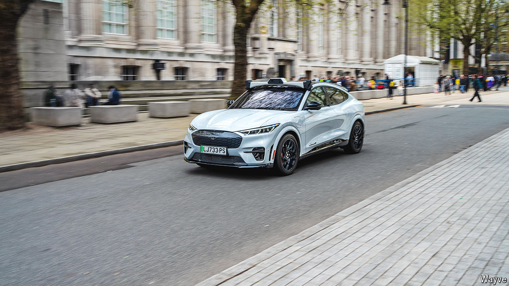

###### Wayve hello

# Wayve achieves Britain’s largest-ever fundraising round 

##### AI + self-driving cars = money 

 

> May 9th 2024 

Roundabouts? No problem. Emergency vehicles? Zebra crossings? A piece of cake. During a recent demonstration ride for  in north London, a self-driving car operated by Wayve, a British startup, even steered around a photo-shoot taking place on the street. Its impressive technology is attracting attention. This week Wayve announced a $1.05bn funding round led by SoftBank, a Japanese conglomerate—Europe’s biggest-ever AI deal. Wayve has integrated its driving system with a chatbot-style language model, so it can explain what it is doing. The company aims to license its technology, which can be adjusted to work with any vehicle. Applied to vans, it is being used in grocery-delivery trials with Asda and Ocado. ■


