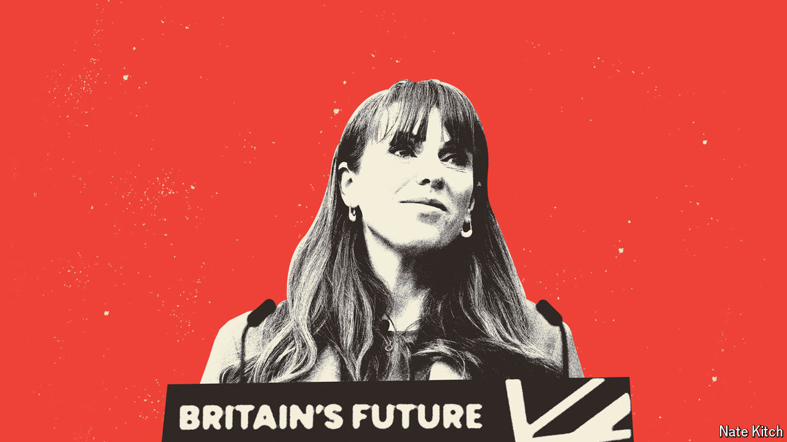

###### Rayner of terror

# Who is Angela Rayner? 

##### The deputy leader of the Labour Party alarms businesses in Britain. Should she? 

 

> May 6th 2024 

Bolshie. Gobby. Blunt. Feisty. Mouthy. Scumbag. Angela Rayner, the deputy leader of the Labour Party, has been called a lot of things, not all of which are nice. She has even—and here perhaps a trigger warning is required—been called “ginger”. She can give as good as she gets: she once called some Tories “scum”; she recently described , the prime minister, as a “pint-sized loser”. 

That Ms Rayner receives such attention is a victory. Most of the  remain just that: shadowy. Ms Rayner, by contrast, stands out: literally (she is tall), visually (she has unarguably red hair) and verbally. Whereas , the Labour leader, utters phrases like “economic growth is the absolute foundational stone for everything”, Ms Rayner tends to say things like “I had my boob job on my 30th birthday” because “my boobs just looked like two boiled eggs in socks”. She causes conniptions. 

