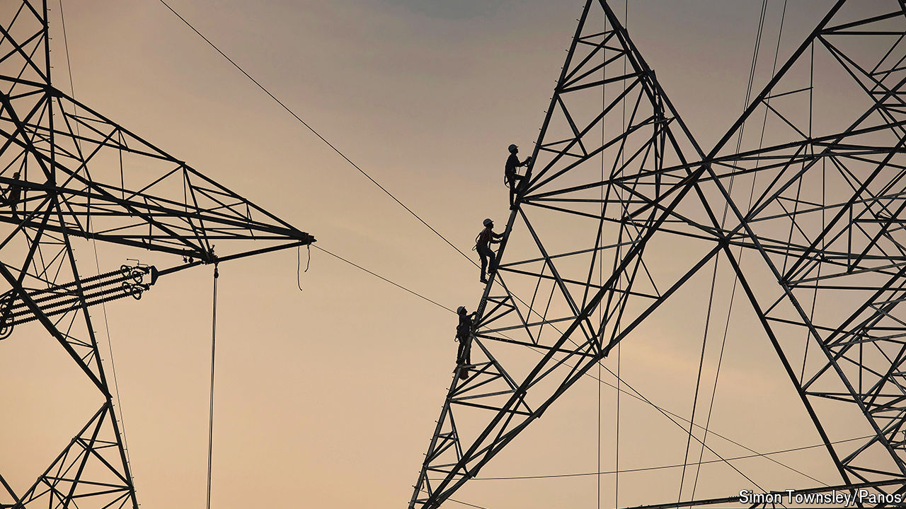

###### Getting serious

# AI and other tricks are bringing power lines into the 21st century 

##### Grids are at last becoming smarter and more efficient 

 

> May 5th 2024 

THE RISE of artificial-intelligence (AI) data centres, with their  for electricity, is asking an awful lot of the world’s utilities and grid operators. On the bright side, AI can also give a fair bit back, by helping transform ancient, overloaded and dumb electricity networks into something fit for the digital and decarbonised age. America’s Department of Energy reckons that AI and other improvements to the country’s existing grid could liberate as much as 100 gigawatts (GW) in transmission and distribution capacity over the next three to five years without the need to build new lines. That is about 13% of current peak demand of around 740GW. 

Some of these “grid-enhancing technologies” are now being rolled out, thanks to doughty startups developing them, their financial backers and utilities, which are becoming less resistant to innovation. GETs, as they are known for short in the industry, fall into two main categories: hardware upgrades to transmission grids and software upgrades to those grids’ brains.

