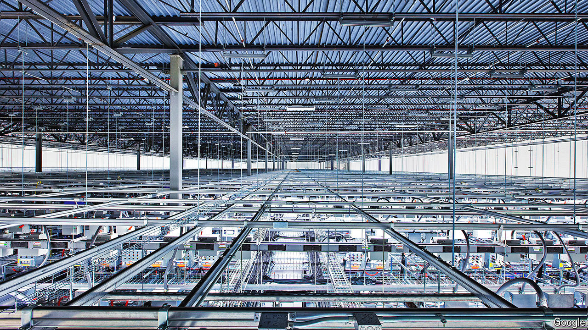

###### How green is your Valley?

# Big tech’s great AI power grab 

##### Alphabet, Amazon and Microsoft are on the hunt for new energy sources 

 

> May 5th 2024 

BIG TECH wants more computing power. A lot more. According to their latest quarterly reports, Alphabet (which owns Google), Amazon and Microsoft—the world’s cloud-computing giants—collectively invested $40bn between January and March, most of it in data centres to deal with growing artificial-intelligence (AI) workloads. Last month Meta, which does not have a cloud business but does run a data-hungry social-media empire, said its capital expenditure could reach $40bn this year as a result of AI-related projects. That is not far off the $50bn that , an oil colossus, is planning to splurge. Microsoft is likely to spend more.

The comparison with the famously capex-happy energy industry is apt not just because of the sums involved. AI needs vast amounts of processing power. And that processing power needs vast amounts of electricity. On May 2nd Bob Blue, chief executive of Dominion Energy, one of America’s biggest utilities, said that data-centre developers now frequently ask him for “several gigawatts” (GW). Dominion’s total installed capacity is 34GW. 

