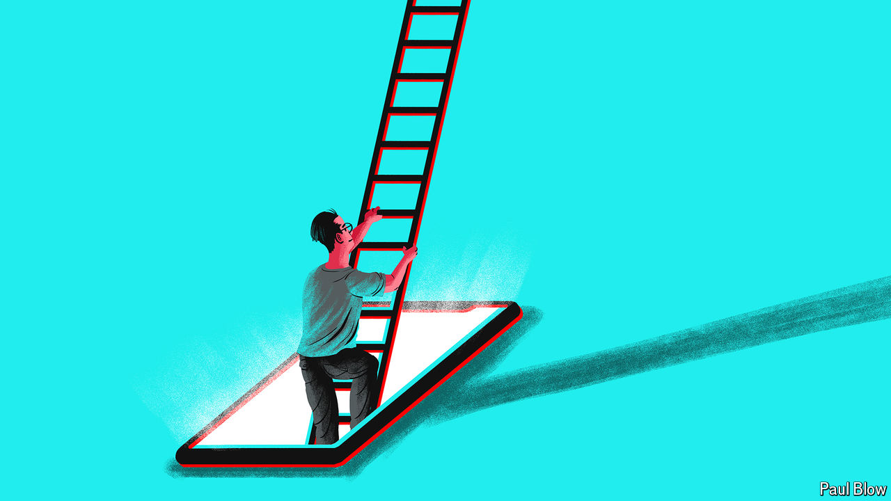

###### Bartleby

# For Gen-Z job-seekers, TikTok is the new LinkedIn 

##### Companies had better start scrolling 

 

> May 9th 2024 

YOUNG JOB-SEEKERS are different from their elders. They expect employers to be cuddlier, more forgiving and more generous with perks and pay cheques. The way they go about hunting for work is also distinct. Rather than relying on family and friends, a growing number of Americans are turning to TikTok in search of advice that will help them climb those all-important first steps up the career ladder. 

Scrolling through their feeds on the short-video app they might come across a creator called Lauren Spearman. Ms Spearman uploads videos about “red-flag job postings” and “unreasonable job applications”. Or they might find Kennie Bukky, who shares her “salary journey” and hot tips for pay negotiations. If they scroll down further, sooner or later they are likely to happen upon Brittany Peatsch. She went viral after posting a video account of her own experience being laid off from Cloudflare, a software company, and now creates videos offering advice to others suffering through similar ordeals. 

