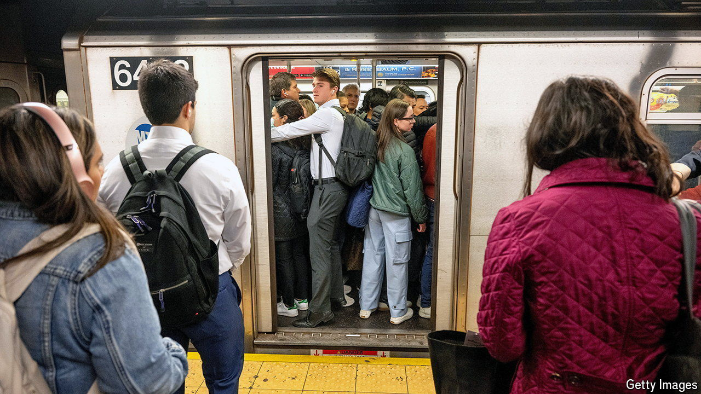
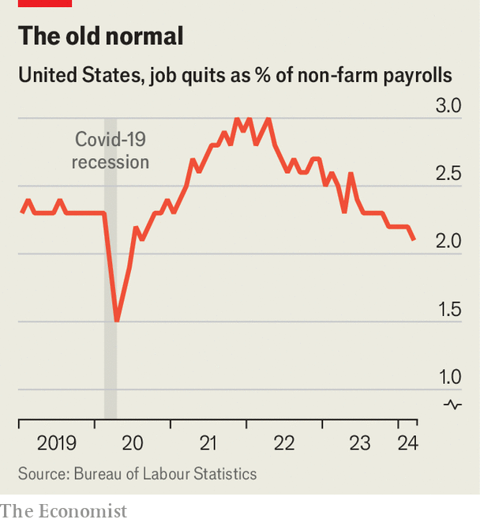

###### Back to work

# Is America Inc’s war for talent over? 

##### Competition has cooled—for now 

 

> May 8th 2024 

Two years ago companies in America were scrambling to plug vacancies from shop floors and call centres to corporate headquarters. Workers laid off during the pandemic proved difficult to lure back, particularly those who had opted for early retirement. Others who spent their lockdowns dreaming of new beginnings resigned en masse once business resumed as normal. The share of American workers quitting their jobs each month went from 2.3% before the pandemic to a record 3% at the start of 2022. By March of that year there were two job openings for every unemployed worker in America.

 


