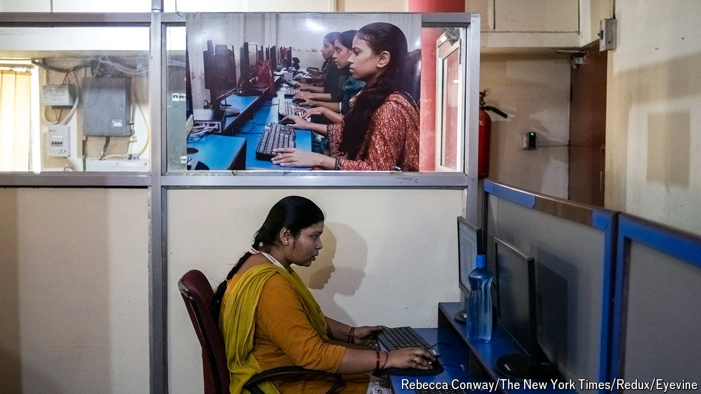
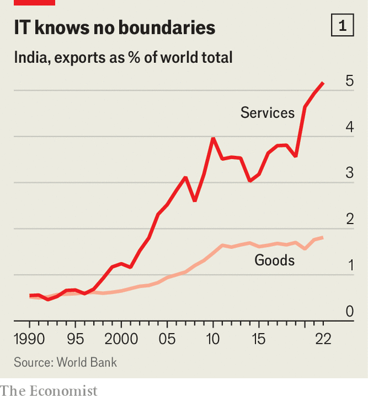

###### Code for trouble

# Will chatbots eat India’s IT industry? 

##### TCS, Infosys and others try to harness the technology first 

 

> May 9th 2024 

WHAT IS THE ideal job to outsource to artificial intelligence? Today’s AIs, in particular the ChatGPT-like generative sort, have a leaky memory, cannot handle physical objects and are worse than humans at interacting with humans. Where they excel is in manipulating numbers and symbols, especially within well-defined tasks such as writing bits of computer code. This happens to be the forte of giant existing outsourcing businesses—India’s information-technology (IT) companies. Seven of them, including the two biggest, Tata Consultancy Services (TCS) and Infosys, collectively laid off 75,000 employees last year. The firms say this reduction, equivalent to about 4% of their combined workforce, has nothing to do with AI and reflects the broader slowdown in the tech sector. In reality, they say, AI is an opportunity, not a threat.

 


