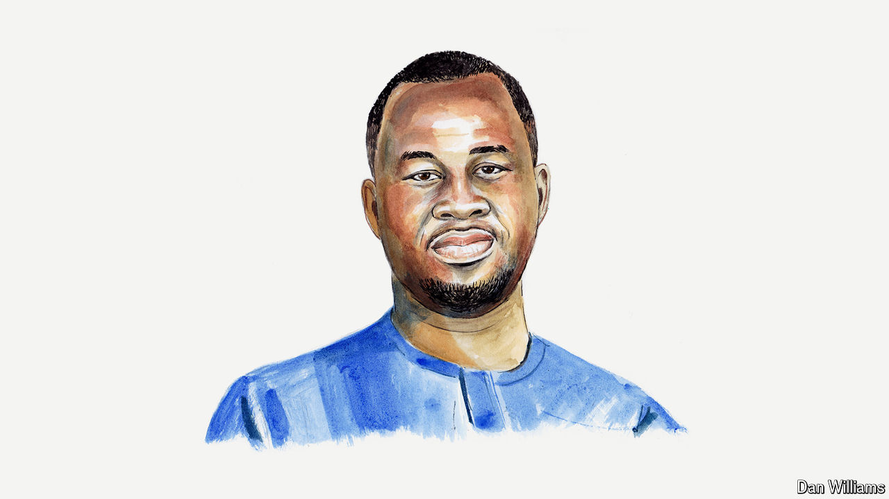

###### Culture war and peace

# Chigozie Obioma laments the West’s growing ideological tribalism 

##### It is grounded in a fear of ideas, says the Nigerian novelist 

 

> May 9th 2024 

I BECAME CURIOUS at a young age, radically so as I grew older. In keeping with Albert Einstein’s dictum that “the important thing is not to stop questioning; curiosity has its own reason for existing,” I exposed myself to every possible idea. 

I have studied religious texts from the Bible to the Koran to the Book of Mormon to the tenets of Odinani, the pantheistic religion of Nigeria’s Igbo people. I have read political philosophies from Winston Churchill’s “The River War” to Karl Marx’s “Communist Manifesto”. I have read books considered to be standard-bearers of leftist thinking and those seen as right-wing intellectual staples.

